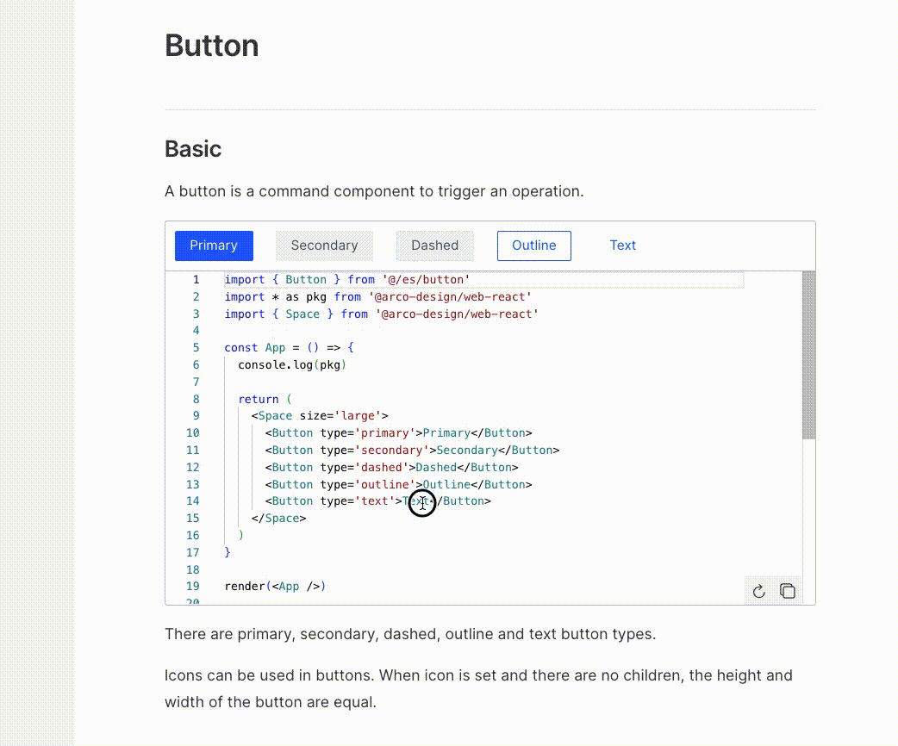

# 这是个啥？

这是一个基于 vitepress 的组件库主题,对于 vitepress 原有样式并不作过多魔改,单纯的增加了组件库相关功能支持.

[demo 在这里](https://tangbohao37.github.io/vitepress-theme-components/demo/button.html)

效果如下：


相对于 vitepress 扩展的功能:

- [x] 支持 react 组件
- [x] changelog 解析与查询
- [x] react 示例组件动态编译
- [x] 组件单测覆盖率展示
- [x] 组件 api
- [x] task list 支持

## 为什么要开发这个 Theme ？

最近公司要自研组件库,vue3 和 react 技术栈同时存在,需要考虑兼容场景。调研了一圈常见的组件库方案。发现多少有点不足, so 自己动手丰衣足食。

### 调研过程

分别调研 `tdesign` / `antd`/`arcod`/`semid`/`dumi`/`histories` 建站方案及相关源码。

`tdesign`: 基于`vite`+`markdown-it` 完成 md 渲染，内部包含大量腾讯内部冗余处理，且部分依赖库闭源。

`antd`： 与 dumi 同渲染方案，内部通过 `webpack` 构建`remark` 进行渲染

`semid`：`storybook`+`gatsby`+`webpack`+闭源部分。极其复杂, 但他的实时编译让我眼前一亮

`arcod`：`storybook`+ 闭源

`histories`: 只支持 vue / svelte

对比后组件库建站方案提取：选择最轻量级方案 `vite`+`markdown-it` 方案渲染 markdown，这与`vitepress`/`tdesign`同方案

既然 `vitepress` 已经帮我们把渲染层的问题搞定了, 那就再添加一些组件库的能力即可,因此就有了这个项目

## 安装

```bash [pnpm]
pnpm add vitepress-theme-components
```

## 使用

1. 引入主题

```ts
// .vitepress/theme/index.ts
import theme from 'vitepress-theme-components';

export default theme;
```

2. 基础配置

```ts
// .vitepress/config.ts
import { type AdvThemeConfig } from 'vitepress-theme-components';
import { baseConfig } from 'vitepress-theme-components/config';

export default defineConfigWithTheme<AdvThemeConfig>({
  extends: baseConfig,
  themeConfig: {
    // changelog: {
    //   path: '/xxx.md'
    // },
    // coverage: {
    //   path: '/xxxx.json'
    // },
  }
});
```
