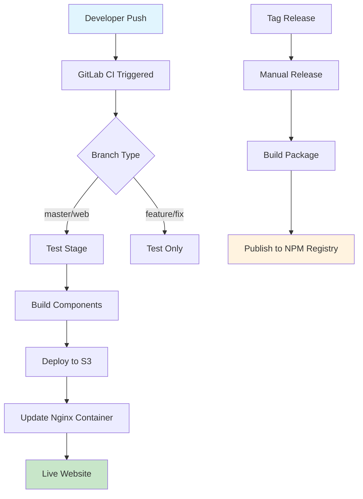

## Deployment Flow

```mermaid
graph TD
    A[Developer Push] --> B[GitLab CI Triggered]
    B --> C{Branch Type}
    C -->|master/web| D[Test Stage]
    C -->|feature/fix| E[Test Only]
    D --> F[Build Components]
    F --> G[Deploy to S3]
    G --> H[Update Nginx Container]
    H --> I[Live Website]

    J[Tag Release] --> K[Manual Release]
    K --> L[Build Package]
    L --> M[Publish to NPM Registry]

    style A fill:#e1f5fe
    style I fill:#c8e6c9
    style M fill:#fff3e0
```
