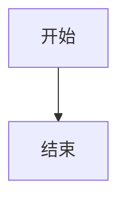

# API 参考

本文档提供了 `vitepress-theme-components` 所有 API 的详细参考。

## 主题配置

### AdvThemeConfig

扩展的主题配置接口，继承自 VitePress 的 `DefaultTheme.Config`。

```typescript
interface AdvThemeConfig extends DefaultTheme.Config {
  changelog?: IChangelog;
  coverage?: ICoverage;
  customPagePath?: string;
}
```

#### changelog

- **类型**: `IChangelog | undefined`
- **默认值**: `undefined`

配置 changelog 相关设置。

```typescript
interface IChangelog {
  path: string;
  parse?: (content: string) => void;
}
```

#### coverage

- **类型**: `ICoverage | undefined`
- **默认值**: `undefined`

配置代码覆盖率相关设置。

```typescript
interface ICoverage {
  path: string;
  parse?: (content: string) => void;
}
```

#### customPagePath

- **类型**: `string | undefined`
- **默认值**: `undefined`

自定义页面路径前缀，匹配的页面将使用空布局。

## 组件 API

### LiveEditor

实时代码编辑器组件。

#### Props

```typescript
interface ILiveEditor {
  sourceCodePath?: string;
  hideCode?: boolean;
  noStyle?: boolean;
  sourceCode?: string;
  scope?: Record<string, any>;
}
```

| 属性           | 类型                  | 默认值  | 说明                              |
| -------------- | --------------------- | ------- | --------------------------------- |
| sourceCodePath | `string`              | -       | 代码文件路径（相对路径）          |
| hideCode       | `boolean`             | `false` | 是否隐藏代码编辑器                |
| noStyle        | `boolean`             | `false` | 是否移除默认样式（边框、内边距）  |
| sourceCode     | `string`              | -       | 直接传入的源代码                  |
| scope          | `Record<string, any>` | `{}`    | 传递给代码的作用域对象            |

#### 使用示例

```md
<!-- 基础用法 -->
<LiveEditor sourceCodePath="../demo/example/button.jsx"></LiveEditor>

<!-- 隐藏代码编辑器 -->
<LiveEditor sourceCodePath="../demo/example/button.jsx" :hideCode="true"></LiveEditor>

<!-- 移除默认样式 -->
<LiveEditor sourceCodePath="../demo/example/button.jsx" :noStyle="true"></LiveEditor>
```

### DrawerLiveEditor

抽屉式代码编辑器组件，继承 `LiveEditor` 的所有属性。

#### 额外 Props

| 属性  | 类型     | 默认值       | 说明     |
| ----- | -------- | ------------ | -------- |
| title | `string` | '代码编辑器' | 抽屉标题 |
| width | `number` | `800`        | 抽屉宽度 |

#### 使用示例

```md
<DrawerLiveEditor 
  sourceCodePath="../demo/example/complex.jsx"
  title="复杂组件演示"
  :width="1000"
></DrawerLiveEditor>
```

### ApiTable

API 文档表格组件。

#### Props

| 属性    | 类型     | 默认值 | 说明                     |
| ------- | -------- | ------ | ------------------------ |
| path    | `string` | -      | TypeScript 文件路径      |
| content | `string` | -      | 直接传入的 Markdown 内容 |

#### 使用示例

```md
<!-- 从文件生成 -->
<ApiTable path="../demo/example/button.tsx"></ApiTable>

<!-- 直接传入内容 -->
<ApiTable content="| 属性 | 类型 | 说明 |"></ApiTable>
```

### MobileIframe

移动端预览组件。

#### Props

| 属性   | 类型     | 默认值           | 说明         |
| ------ | -------- | ---------------- | ------------ |
| src    | `string` | -                | 预览页面地址 |
| width  | `number` | `375`            | 设备宽度     |
| height | `number` | `667`            | 设备高度     |
| title  | `string` | 'Mobile Preview' | 设备标题     |

#### 使用示例

```md
<!-- 基础用法 -->
<MobileIframe src="/demo/mobile/button"></MobileIframe>

<!-- 自定义尺寸 -->
<MobileIframe 
  src="/demo/mobile/button" 
  :width="414" 
  :height="896"
  title="iPhone XR"
></MobileIframe>
```

### Mermaid

图表渲染组件。

#### Props

| 属性     | 类型      | 默认值  | 说明               |
| -------- | --------- | ------- | ------------------ |
| id       | `string`  | -       | 图表唯一标识       |
| graph    | `string`  | -       | 图表定义代码       |
| showCode | `boolean` | `false` | 是否显示源代码切换 |

#### 使用示例

```md
<!-- 在 Markdown 中使用 -->


<!-- 可交互模式 -->

```

## Frontmatter API

### MdFormat

页面级别的配置选项。

```typescript
interface MdFormat {
  hideRecord?: boolean;
  coverage?: boolean;
  componentName?: string;
}
```

#### hideRecord

- **类型**: `boolean`
- **默认值**: `false`

是否隐藏当前组件的迭代记录。

#### coverage

- **类型**: `boolean`
- **默认值**: `false`

是否显示组件的测试覆盖率。

#### componentName

- **类型**: `string`
- **默认值**: `undefined`

组件名称，用于获取覆盖率和迭代记录。

#### 使用示例

```md
---
hideRecord: true
coverage: true
componentName: Button
---

# 按钮组件

组件内容...
```

## 插件 API

### demoBlockPlugin

核心 Markdown 插件，处理自定义组件的渲染。

```typescript
function demoBlockPlugin(md: MarkdownRenderer): void
```

#### 参数

- `md`: VitePress 的 Markdown 渲染器实例

#### 功能

- 解析 `<LiveEditor>` 组件
- 解析 `<DrawerLiveEditor>` 组件
- 解析 `<ApiTable>` 组件
- 处理 Mermaid 图表渲染
- 支持自定义容器语法

### parseProps

解析组件属性的工具函数。

```typescript
function parseProps<T extends Record<string, any> = any>(
  content: string
): T
```

#### 参数

- `content`: 组件的 HTML 字符串

#### 返回值

解析后的属性对象。

#### 使用示例

```typescript
const props = parseProps<{ path: string }>('<ApiTable path="./button.tsx"></ApiTable>');
console.log(props.path); // "./button.tsx"
```

## 工具函数

### importRegex

用于匹配 import 语句的正则表达式。

```typescript
const importRegex: RegExp
```

### scriptRE, scriptSetupRE, scriptClientRE

用于匹配不同类型 script 标签的正则表达式。

```typescript
const scriptRE: RegExp
const scriptSetupRE: RegExp
const scriptClientRE: RegExp
```

## React 组件 API

### ReactLive

React Live 组件的封装。

```typescript
interface IReactLive {
  sourceCode?: string;
  scope?: Record<string, any>;
  noStyle?: boolean;
}

const ReactLive: FC<IReactLive>
```

#### Props

| 属性       | 类型                  | 默认值  | 说明                             |
| ---------- | --------------------- | ------- | -------------------------------- |
| sourceCode | `string`              | -       | React 源代码                     |
| scope      | `Record<string, any>` | `{}`    | 作用域对象                       |
| noStyle    | `boolean`             | `false` | 是否移除默认样式                 |

## 类型定义

### 完整类型导出

```typescript
// 从主包导出
export { AdvThemeConfig } from 'vitepress-theme-components';

// 组件相关类型
export interface ILiveEditor {
  sourceCodePath?: string;
  hideCode?: boolean;
  noStyle?: boolean;
  sourceCode?: string;
  scope?: Record<string, any>;
}

export interface IReactLive {
  sourceCode?: string;
  scope?: Record<string, any>;
  noStyle?: boolean;
}

export type MdFormat = {
  hideRecord?: boolean;
  coverage?: boolean;
  componentName?: string;
};
```

## 配置文件 API

### baseConfig

预配置的 VitePress 配置对象。

```typescript
const baseConfig: UserConfig
```

包含以下预配置：

- Markdown 插件注册
- Vite 优化配置
- React 支持
- 依赖预编译设置

#### 使用示例

```typescript
// .vitepress/config.ts
import { baseConfig } from 'vitepress-theme-components/config';

export default defineConfig({
  extends: baseConfig,
  // 你的自定义配置
});
```

## 错误处理

### 常见错误类型

#### 文件不存在错误

当 `sourceCodePath` 指向的文件不存在时：

```
Error: ../demo/example/button.jsx 未找到原文件!
```

#### 语法解析错误

当代码语法错误时：

```
Error: 语句解析错误
```

#### 类型生成错误

当 TypeScript 文件无法解析时：

```
Error: react-docgen-typescript parse error
```

### 错误处理最佳实践

1. **文件路径检查**: 确保所有引用的文件路径正确
2. **语法验证**: 确保演示代码语法正确
3. **类型定义**: 为 TypeScript 文件提供完整的类型定义
4. **错误边界**: 在组件中添加适当的错误处理

## 版本兼容性

### 支持的版本

- **VitePress**: `>= 1.0.0`
- **Vue**: `>= 3.3.0`
- **React**: `>= 18.0.0`
- **Node.js**: `>= 18.0.0`

### 破坏性变更

查看 [CHANGELOG.md](https://github.com/tangbohao37/vitepress-theme-components/blob/main/CHANGELOG.md) 了解版本间的破坏性变更。
