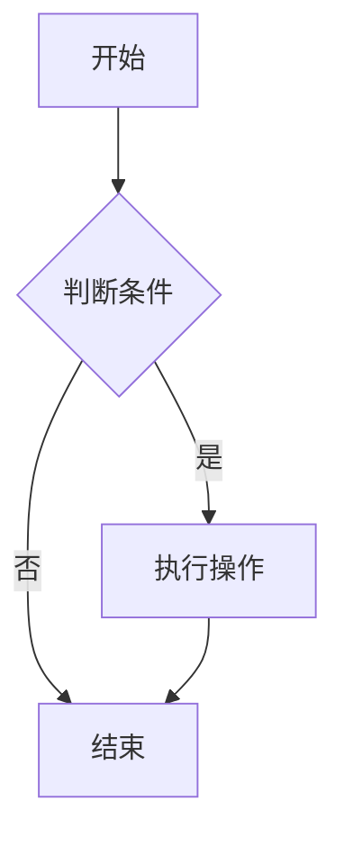

# 组件使用指南

本主题提供了多个内置组件，用于增强文档的交互性和功能性。

## LiveEditor - 实时代码编辑器

`LiveEditor` 是核心组件，支持 React 代码的实时编辑和预览。

### 基本用法

```md
<LiveEditor sourceCodePath="../demo/example/button.jsx"></LiveEditor>
```

### 属性说明

| 属性           | 说明                              | 类型    | 默认值 |
| -------------- | --------------------------------- | ------- | ------ |
| sourceCodePath | 代码文件路径（相对路径）          | string  | -      |
| hideCode       | 是否隐藏代码编辑器                | boolean | false  |
| noStyle        | 是否移除默认样式（边框、内边距）  | boolean | false  |
| scope          | 传递给代码的作用域对象            | object  | {}     |

### 特性

- **实时编译**：代码修改后立即预览效果
- **语法高亮**：基于 Monaco Editor 的代码高亮
- **错误提示**：编译错误会在预览区域显示
- **背景切换**：支持透明背景和网格背景切换

## DrawerLiveEditor - 抽屉式代码编辑器

抽屉式的代码编辑器，适用于复杂的代码演示场景。

### 基本用法

```md
<DrawerLiveEditor sourceCodePath="../demo/example/complex-component.jsx"></DrawerLiveEditor>
```

### 特性

- 继承 `LiveEditor` 的所有功能
- 抽屉式界面，节省页面空间
- 支持全屏编辑模式

## MobileIframe - 移动端预览

提供移动端设备的预览框架。

### 基本用法

```md
<MobileIframe src="/demo/mobile/"></MobileIframe>
```

### 属性说明

| 属性   | 说明           | 类型   | 默认值 |
| ------ | -------------- | ------ | ------ |
| src    | 预览页面地址   | string | -      |
| width  | 设备宽度       | number | 375    |
| height | 设备高度       | number | 667    |

## Mermaid - 图表渲染

支持 Mermaid 图表的渲染。

### 基本用法

````md

````

### 支持的图表类型

- 流程图（Flowchart）
- 序列图（Sequence Diagram）
- 甘特图（Gantt Chart）
- 类图（Class Diagram）
- 状态图（State Diagram）
- 饼图（Pie Chart）

### 特性

- **交互式预览**：支持代码和图表的切换显示
- **主题适配**：自动适配明暗主题
- **懒加载**：使用 Suspense 组件优化加载性能

## 组件组合使用

多个组件可以组合使用，创建丰富的文档体验：

```md
# 按钮组件

<LiveEditor sourceCodePath="../demo/example/button.jsx"></LiveEditor>

## 移动端预览

<MobileIframe src="/demo/mobile/button"></MobileIframe>
```

## 最佳实践

### 1. 文件组织

建议将演示代码文件统一放在 `docs/demo/example/` 目录下：

```
docs/
├── demo/
│   ├── example/
│   │   ├── button.jsx
│   │   ├── input.jsx
│   │   └── index.css
│   └── button.md
└── guide/
```

### 2. 代码规范

演示代码应该遵循以下规范：

```jsx
import { Button } from '@arco-design/web-react';

const Example = () => {
  return (
    <Button type="primary">
      点击我
    </Button>
  );
};

render(<Example />);
```

### 3. 样式处理

- 全局样式可以放在 `docs/demo/example/index.css`
- 组件特定样式建议内联或使用 CSS-in-JS
- 避免样式冲突，使用 BEM 命名规范

### 4. 性能优化

- 使用 `hideCode` 属性隐藏不必要的代码编辑器
- 复杂组件使用 `DrawerLiveEditor` 避免页面过长
- 合理使用 `noStyle` 属性减少不必要的样式渲染
