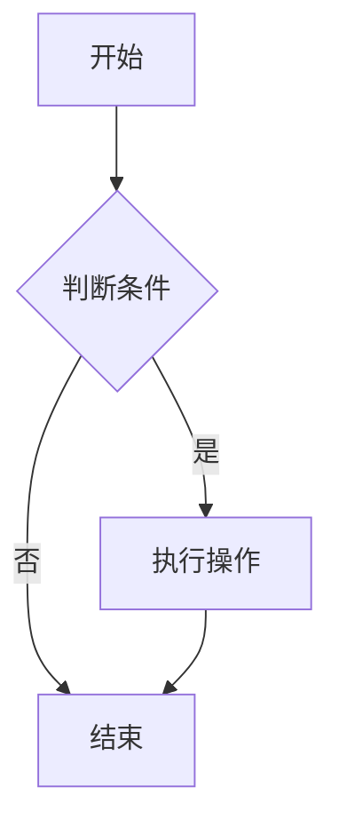
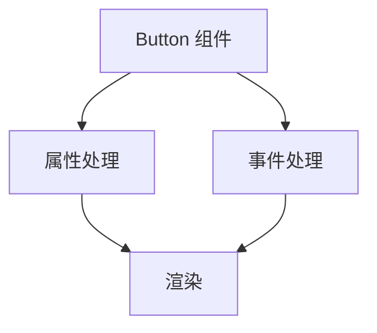
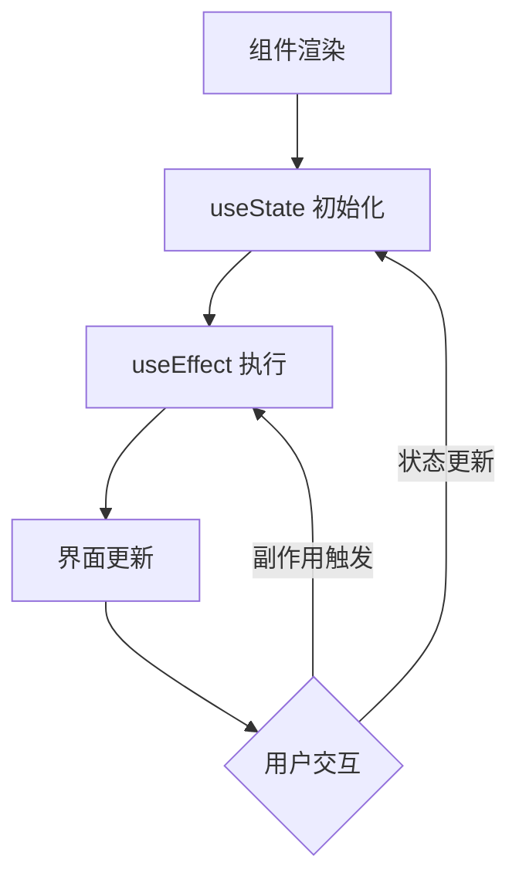
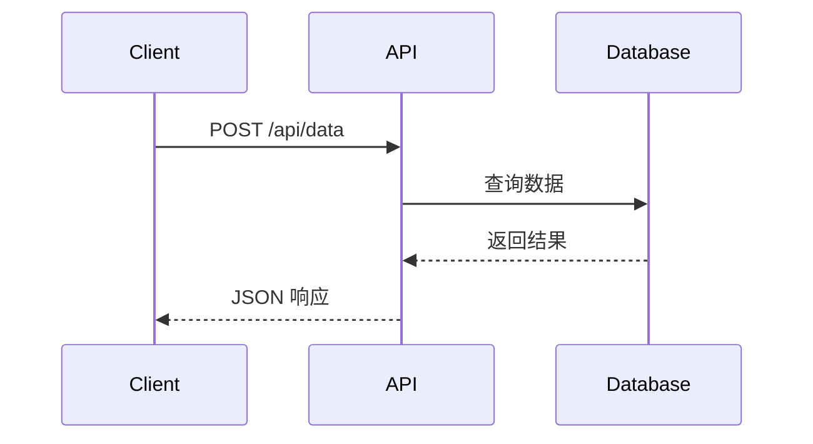

# 组件使用指南

本主题提供了多个内置组件，用于增强文档的交互性和功能性。每个组件都有详细的使用文档，包括 API 参数、核心特性、技术实现和最佳实践。

## 核心组件

### LiveEditor - 实时代码编辑器

`LiveEditor` 是核心组件，支持 React 代码的实时编辑和预览。

**快速开始**

```md
<LiveEditor sourceCodePath="../demo/example/button.jsx"></LiveEditor>
```

**主要特性**
- 实时编译预览
- 语法高亮编辑
- 背景切换
- 代码折叠展开

[查看完整文档 →](./components/live-editor.md)

---

### SandpackEditor - 在线代码编辑器

`SandpackEditor` 是基于 Sandpack 的在线代码编辑器，专为移动端应用演示设计。

**快速开始**

```md
<SandpackEditor path="button.jsx"></SandpackEditor>
```

**主要特性**
- 移动设备预览框架（iPhone/Android）
- 自动依赖加载
- 可调节预览高度
- 编辑/只读模式
- 完整的 npm 依赖支持

[查看完整文档 →](./components/sandpack-editor.md)

---

### Mermaid - 图表渲染组件

`Mermaid` 支持流程图、序列图、甘特图等多种图表类型的渲染。

**快速开始**

````md

````

**主要特性**
- 实时编辑
- 主题自动适配
- 支持 10+ 种图表类型
- ZenUML 扩展支持

[查看完整文档 →](./components/mermaid.md)

---

## 组件对比

### 代码编辑器组件对比

| 特性           | LiveEditor      | SandpackEditor       |
| -------------- | --------------- | -------------------- |
| 编译方式       | 浏览器端编译    | Sandpack 在线编译    |
| 移动设备预览   | ❌              | ✅ 内置设备框架      |
| 依赖管理       | 需手动配置      | 自动加载相对路径依赖 |
| npm 包支持     | 有限            | ✅ 完整支持          |
| 多文件项目     | ❌              | ✅ 自动解析          |
| 性能           | 轻量快速        | 相对较重             |
| 代码文件位置   | `demo/example/` | `public/example/`    |
| 布局方式       | 折叠面板        | 折叠面板             |
| 适用设备       | 桌面端          | 桌面端 + 移动端      |

### 选择建议

#### 使用 LiveEditor

- ✅ 简单的 UI 组件示例
- ✅ 桌面端文档
- ✅ 快速原型演示
- ✅ 单文件示例

#### 使用 SandpackEditor

- ✅ 移动端应用演示
- ✅ 需要 npm 包的完整项目
- ✅ 多文件组织的复杂项目
- ✅ 需要真实设备预览
- ✅ 只读代码展示

## 组合使用

多个组件可以组合使用，创建丰富的文档体验。

### 示例 1：完整的组件文档

```md
# 按钮组件

## 基础用法

<LiveEditor sourceCodePath="../demo/example/index.jsx"></LiveEditor>

## 架构设计


```

### 示例 2：教程文档

```md
# React Hooks 教程

## 流程图



## 代码示例

<LiveEditor sourceCodePath="../demo/example/button.jsx"></LiveEditor>

## 移动端体验

<SandpackEditor path="button-status.jsx"></SandpackEditor>
```

### 示例 3：API 文档

```md
# API 调用流程

## 序列图



## 调用示例

<LiveEditor sourceCodePath="../demo/example/button-icons.jsx"></LiveEditor>
```

## 最佳实践

### 1. 文件组织

#### LiveEditor

```
docs/
├── demo/
│   ├── example/
│   │   ├── button.jsx
│   │   ├── input.jsx
│   │   └── index.css
│   └── button.md
```

#### SandpackEditor

```
docs/public/example/
├── button.jsx
├── mobile-app.jsx
├── components/
│   ├── header.jsx
│   └── footer.jsx
└── styles/
    └── app.css
```

::: tip 目录差异
- **LiveEditor**: 使用 `docs/demo/example/`
- **SandpackEditor**: 使用 `docs/public/example/`（需要通过 HTTP 动态加载）
:::

### 2. 代码规范

所有编辑器组件都要求使用 `render()` 函数：

```jsx
import { Button } from '@arco-design/web-react';

const Example = () => {
  return <Button type="primary">点击我</Button>;
};

render(<Example />); // 必须使用 render() // [!code highlight]
```

::: danger 重要
- **不要使用** `export default Component`
- **必须使用** `render(<Component />)`
- 只有被导入的子文件才使用 `export default`
:::

### 3. 性能优化

#### 限制组件数量

```md
<!-- ✅ 推荐：适量使用 -->
一个页面 3-5 个编辑器组件

<!-- ❌ 避免：过多实例 -->
一个页面 10+ 个编辑器组件
```

#### 默认收起编辑器

```
<!-- ✅ 推荐：默认收起 -->
<SandpackEditor path="app.jsx"></SandpackEditor>

<!-- ⚠️ 谨慎：只在必要时展开 -->
<SandpackEditor path="app.jsx" defaultExpanded></SandpackEditor>
```

#### 使用 hideCode 简化界面

```
<!-- 只显示预览，隐藏代码 -->
<LiveEditor sourceCodePath="../demo/example/button.jsx" hideCode></LiveEditor>
```

### 4. 样式处理

#### 内联样式

```jsx
render(
  <Button style={{ margin: '10px', padding: '20px' }}>
    按钮
  </Button>
);
```

#### CSS-in-JS

```jsx
const styles = {
  container: { padding: 20, backgroundColor: '#f5f5f5' }
};

render(<div style={styles.container}>内容</div>);
```

#### 全局样式

```css
/* docs/demo/example/index.css 或 docs/public/example/styles.css */
.custom-button {
  margin: 10px;
  padding: 20px;
}
```

### 5. 移动端适配

使用 SandpackEditor 时注意移动端适配：

```jsx
const App = () => {
  return (
    <div style={{
      padding: '16px',
      paddingTop: 'max(16px, env(safe-area-inset-top))',     // 安全区域
      paddingBottom: 'max(16px, env(safe-area-inset-bottom))',
      minHeight: '100vh',
      fontSize: 'clamp(14px, 4vw, 16px)'                      // 响应式字体
    }}>
      {/* 内容 */}
    </div>
  );
};

render(<App />);
```

## 常见问题

### Q: 如何选择合适的编辑器组件？

参考"组件对比"部分的"选择建议"：

- 简单组件示例 → `LiveEditor`
- 移动应用演示 → `SandpackEditor`
- 复杂多文件项目 → `SandpackEditor`

### Q: 代码文件应该放在哪里？

- **LiveEditor**: `docs/demo/example/`
- **SandpackEditor**: `docs/public/example/`

### Q: 为什么我的代码无法运行？

检查以下几点：

1. 是否使用了 `render()` 函数
2. 文件路径是否正确
3. 导入的包是否支持
4. 代码语法是否正确

### Q: 如何调试组件？

使用浏览器控制台：

```jsx
const Example = () => {
  console.log('Component rendered'); // [!code highlight]
  return <Button>Test</Button>;
};

render(<Example />);
```

### Q: 可以在组件中使用 TypeScript 吗？

- **LiveEditor**: 主要支持 JSX
- **SandpackEditor**: 支持 `.tsx` 文件

### Q: 如何添加自定义 npm 依赖？

目前只有 `SandpackEditor` 完整支持 npm 包，但需要修改源码配置。详见 [SandpackEditor 文档](./components/sandpack-editor.md#常见问题)。

## 扩展阅读

### 详细文档

- [LiveEditor 完整文档](./components/live-editor.md)
- [SandpackEditor 完整文档](./components/sandpack-editor.md)
- [Mermaid 完整文档](./components/mermaid.md)

### 相关指南

- [快速开始](./start.md) - 安装和配置
- [Markdown 增强](./markdown.md) - Markdown 语法扩展
- [移动端预览](./mobile-preview.md) - 移动端开发指南
- [自定义配置](./config.md) - 主题配置选项
- [插件开发](./plugin-development.md) - 开发自定义插件

## 反馈和贡献

如果您在使用组件时遇到问题，或有改进建议，欢迎：

- 提交 [GitHub Issue](https://github.com/your-repo/issues)
- 发起 [Pull Request](https://github.com/your-repo/pulls)
- 查看 [故障排除指南](./troubleshooting.md)
