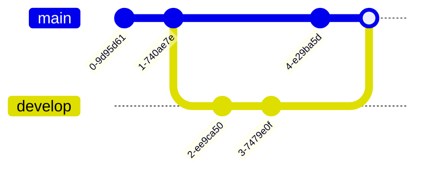
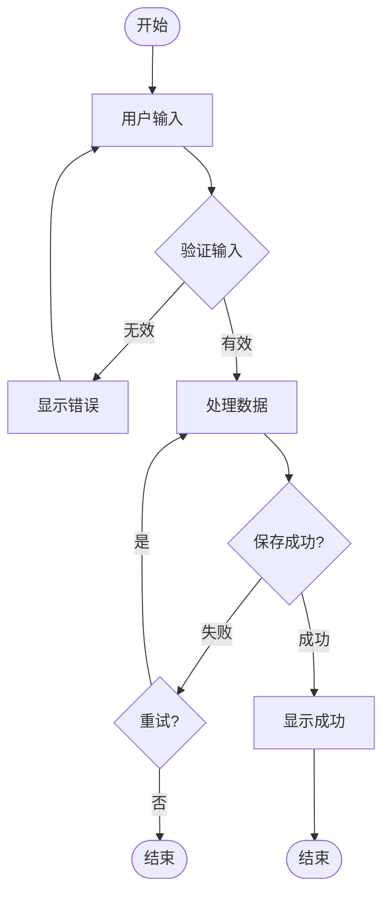

# Mermaid - 图表渲染组件

`Mermaid` 是一个基于 [Mermaid.js](https://mermaid.js.org/) 的图表渲染组件，支持流程图、序列图、甘特图等多种图表类型。它提供了可编辑的代码视图和实时渲染预览，特别适合在技术文档中展示架构图和流程图。

## 基础用法

在 Markdown 中使用标准的 mermaid 代码块：

````md

````

渲染效果：


::: tip
组件会自动将 mermaid 代码块渲染为可交互的图表，并支持代码编辑和实时更新。
:::

## API 参数

| 参数       | 说明                     | 类型      | 默认值  |
| ---------- | ------------------------ | --------- | ------- |
| `graph`    | 图表代码（URL 编码后）   | `string`  | **必填** |
| `id`       | 图表唯一标识符           | `string`  | **必填** |
| `showCode` | 是否显示代码编辑器       | `boolean` | `true`  |

::: info 参数说明
通常不需要手动设置这些参数，VitePress 插件会自动处理 mermaid 代码块并传递正确的参数。
:::

### 参数详解

#### graph（必填）

图表的 Mermaid 代码，经过 URL 编码：

```ts
const graph = encodeURIComponent(`
graph TD
    A[开始] --> B[结束]
`);
```

#### id（必填）

每个图表需要唯一的 ID，用于 Mermaid 渲染：

```ts
const id = 'mermaid-chart-' + Date.now();
```

#### showCode

控制是否显示代码编辑器：

```vue{1-13}
<template>
  <div v-if="props.showCode">
    <h5>Code:</h5>
    <div class="language-mermaid">
      <button class="copy"></button>
      <span class="lang">mermaid</span>
      <pre><code 
        :contenteditable="contentEditable" 
        @input="updateCode"  
        @keydown.meta.enter="renderChart" 
        @keydown.ctrl.enter="renderChart" 
        ref="editableContent"
      ></code></pre>
    </div>
  </div>
  <div v-html="svg"></div>
</template>
```

## 核心特性

### 1. 实时编辑

代码区域可编辑，支持快捷键触发渲染：

```vue{7,39-47}
<template>
  <pre><code 
    :contenteditable="contentEditable" 
    @input="updateCode"
    @keydown.meta.enter="renderChart"
    @keydown.ctrl.enter="renderChart"
    ref="editableContent"
  ></code></pre>
  <div class="buttons-container">
    <span>{{ ctrlSymbol }} + Enter</span><span>|</span>
    <button @click="renderChart">Run ▶</button>
  </div>
</template>

<script setup>
const code = ref(decodeURIComponent(props.graph));
const ctrlSymbol = ref(navigator.platform.includes('Mac') ? '⌘' : 'Ctrl');
const isFirefox = navigator.userAgent.toLowerCase().includes('firefox');
const contentEditable = ref(isFirefox ? 'true' : 'plaintext-only');

const updateCode = (event) => {
  code.value = event.target.innerText;
};
</script>
```

编辑特性：
- **内容可编辑**：使用 `contenteditable` 属性
- **快捷键支持**：`⌘/Ctrl + Enter` 触发渲染
- **手动渲染**：点击 "Run ▶" 按钮渲染
- **浏览器兼容**：Firefox 使用 `true`，其他浏览器使用 `plaintext-only`

::: info contenteditable 属性
- **`plaintext-only`**：只允许纯文本，不保留格式（Chrome/Safari）
- **`true`**：允许富文本编辑（Firefox）

使用 `plaintext-only` 可以避免粘贴时带入格式，保持代码纯净。
:::

### 2. 主题自动适配

根据 VitePress 的明暗主题自动切换图表主题：

```ts{87-95}
const renderChart = async () => {
  const hasDarkClass = document.documentElement.classList.contains('dark');
  const mermaidConfig = {
    securityLevel: 'loose',
    startOnLoad: false,
    theme: hasDarkClass ? 'dark' : 'default', // [!code highlight]
  };
  let svgCode = await render(props.id, code.value, mermaidConfig);
  svg.value = svgCode;
};
```

主题配置：
- **亮色主题**：使用 `default` 主题
- **暗色主题**：使用 `dark` 主题
- **自动切换**：监听 DOM 的 `dark` class 变化

### 3. 主题切换监听

使用 `MutationObserver` 监听主题变化并重新渲染：

```ts{43-51}
let mut = null;

onMounted(async () => {
  mut = new MutationObserver(() => renderChart()); // [!code highlight]
  mut.observe(document.documentElement, { attributes: true }); // [!code highlight]

  // 设置初始代码
  if (editableContent.value) {
    editableContent.value.textContent = code.value;
  }

  await renderChart();
});

onUnmounted(() => mut.disconnect());
```

::: info MutationObserver
监听 `document.documentElement` 的属性变化（主要是 `class` 属性），当检测到主题切换时自动重新渲染图表。
:::

### 4. 图片延迟加载处理

对于包含图片的图表，等待图片加载完成后再渲染：

```ts{60-83}
await renderChart();

// 刷新包含图片的图表 // [!code highlight]
const hasImages = //.exec(code.value)?.length > 0; // [!code highlight]
if (hasImages) // [!code highlight]
  setTimeout(() => {
    let imgElements = document.getElementsByTagName('img');
    let imgs = Array.from(imgElements);
    if (imgs.length) {
      Promise.all(
        imgs
          .filter((img) => !img.complete)
          .map(
            (img) =>
              new Promise((resolve) => {
                img.onload = img.onerror = resolve;
              })
          )
      ).then(() => {
        renderChart();
      });
    }
  }, 100);
```

::: info 图片加载优化
这个机制特别重要，因为 Mermaid 可能在图表中引用外部图片。如果图片未加载完成就渲染，可能导致图表尺寸计算错误或显示不完整。
:::

### 5. 强制重渲染机制

通过添加随机盐值强制 Vue 重新渲染 SVG：

```ts{95-103}
const renderChart = async () => {
  console.log('rendering chart' + props.id + code.value);
  const hasDarkClass = document.documentElement.classList.contains('dark');
  const mermaidConfig = {
    securityLevel: 'loose',
    startOnLoad: false,
    theme: hasDarkClass ? 'dark' : 'default',
  };
  let svgCode = await render(props.id, code.value, mermaidConfig);
  
  // 添加随机盐值强制重渲染 // [!code highlight]
  const salt = Math.random().toString(36).substring(7); // [!code highlight]
  svg.value = `${svgCode} <span style="display: none">${salt}</span>`; // [!code highlight]
};
```

::: warning 为什么需要强制重渲染
这是一个关键的技术细节。在以下场景中，如果不添加盐值，图表会消失：
- **切换主题时**：从亮色切换到暗色，或反之
- **刷新页面时**：页面重新加载

原因是 Mermaid 在渲染过程中会删除旧的 SVG 元素，但因为 `svgCode` 字符串内容未变化，Vue 的 `v-html` 不会重新渲染。添加随机盐值后，每次 `svg.value` 都是新值，确保 Vue 重新渲染。

这个问题不是所有图表都会遇到，但对于 **c4c**、**mindmap** 和 **zenuml** 等复杂图表类型是必需的。
:::

## 技术实现

### Mermaid 初始化

使用单独的 `mermaid.ts` 文件初始化 Mermaid：

```ts{1-18}
import mermaid, { type MermaidConfig } from 'mermaid';
import zenuml from '@mermaid-js/mermaid-zenuml';

// 注册 ZenUML 扩展图表 // [!code highlight]
const init = mermaid.registerExternalDiagrams([zenuml]); // [!code highlight]

// 注册图标包 // [!code highlight]
mermaid.registerIconPacks([ // [!code highlight]
  {
    name: 'logos',
    loader: () =>
      fetch('https://unpkg.com/@iconify-json/logos/icons.json').then((res) => res.json()),
  },
]); // [!code highlight]

export const render = async (id: string, code: string, config: MermaidConfig): Promise<string> => {
  await init;
  mermaid.initialize(config);
  const { svg } = await mermaid.render(id, code);
  return svg;
};
```

初始化特性：
- **ZenUML 支持**：注册 ZenUML 外部图表插件
- **图标包**：注册 Iconify logos 图标包，支持在图表中使用品牌图标
- **异步渲染**：使用 async/await 确保初始化完成后再渲染
- **配置灵活**：支持传入自定义 Mermaid 配置

::: info ZenUML
ZenUML 是一种专注于序列图的 UML 工具，语法更简洁。通过注册扩展图表，Mermaid 可以支持 ZenUML 语法。
:::

### 安全配置

渲染时使用 `loose` 安全级别：

```ts{3}
const mermaidConfig = {
  securityLevel: 'loose',
  startOnLoad: false,
  theme: hasDarkClass ? 'dark' : 'default',
};
```

::: warning 安全级别说明
- **`strict`**：最严格，禁用所有可能不安全的功能
- **`loose`**：宽松模式，允许更多功能（如 HTML 标签、外部链接等）
- **`antiscript`**：允许大部分功能，但禁止脚本执行

这里使用 `loose` 是为了支持更丰富的图表功能，但需要确保图表代码来源可信。
:::

## 支持的图表类型

### 1. 流程图（Flowchart）

````md

````

### 2. 序列图（Sequence Diagram）

````md

````

### 3. 甘特图（Gantt Chart）

````md

````

### 4. 类图（Class Diagram）

````md

````

### 5. 状态图（State Diagram）

````md

````

### 6. ER 图（Entity Relationship Diagram）

````md

````

### 7. 饼图（Pie Chart）

````md

````

### 8. Git 图（Git Graph）

````md

````

### 9. 用户旅程图（User Journey）

````md

````

### 10. 思维导图（Mind Map）

````md

````

### 11. ZenUML 序列图

````md

````

## 使用示例

### 示例 1：系统架构图

````md

````

### 示例 2：业务流程图

````md

````

### 示例 3：API 交互序列图

````md

````

### 示例 4：组件依赖关系

````md

````

### 示例 5：项目时间线

````md

````

## 最佳实践

### 1. 代码格式化

保持代码清晰易读：

````md

````

### 2. 使用子图组织复杂图表

````md

````

### 3. 添加样式和类

````md
```mermaid
graph LR
    A[重要节点]:::important --> B[普通节点]
    B --> C[警告节点]:::warning
    
    classDef important fill:#f96,stroke:#333,stroke-width:4px
    classDef warning fill:#ff6,stroke:#f66,stroke-width:2px
```
````

### 4. 使用图标增强表达

````md
```mermaid
graph LR
    A["fab:fa-react React"] --> B["fab:fa-node Node.js"]
    B --> C["fas:fa-database Database"]
```
````

::: tip 图标支持
组件已注册 Iconify logos 图标包，可以在图表中使用品牌图标。使用格式：`"fab:fa-icon-name Text"`
:::

### 5. 性能优化

对于复杂图表，考虑拆分为多个小图表：

````md
<!-- ✅ 推荐：拆分为多个图表 -->
## 系统概览

```mermaid
graph TD
    Client --> Gateway
    Gateway --> Services
```

## 服务详情

```mermaid
graph TD
    Services --> UserService
    Services --> OrderService
    Services --> PaymentService
```

<!-- ❌ 避免：单个超大图表 -->
```mermaid
graph TD
    %% 100+ 个节点...
```
````

## 常见问题

### Q: 为什么图表在切换主题后消失？

这是已知问题，组件已通过添加随机盐值解决：

```ts
const salt = Math.random().toString(36).substring(7);
svg.value = `${svgCode} <span style="display: none">${salt}</span>`;
```

如果仍然出现问题，检查是否使用了最新版本的组件。

### Q: 如何禁用代码编辑功能？

设置 `showCode` 为 `false`：

```vue
<Mermaid :graph="encodedCode" :id="chartId" :showCode="false"></Mermaid>
```

### Q: 支持自定义主题吗？

可以在渲染时传入自定义主题配置：

```ts
const mermaidConfig = {
  securityLevel: 'loose',
  startOnLoad: false,
  theme: 'forest', // 使用 forest 主题 // [!code highlight]
  themeVariables: { // [!code highlight]
    primaryColor: '#ff6b6b', // [!code highlight]
    secondaryColor: '#4ecdc4' // [!code highlight]
  } // [!code highlight]
};
```

内置主题：`default`、`dark`、`forest`、`neutral`

### Q: 如何导出图表为图片？

可以使用浏览器的开发者工具：

1. 右键点击渲染后的 SVG
2. 选择"检查元素"
3. 右键 `<svg>` 标签
4. 选择"Copy" → "Copy outerHTML"
5. 将 SVG 代码保存为 `.svg` 文件

或者使用截图工具直接截取图表。

### Q: 图表中文字体显示异常怎么办？

检查以下几点：

1. **字体是否支持中文**

```css
svg {
  font-family: -apple-system, BlinkMacSystemFont, 'Segoe UI', 
               'PingFang SC', 'Hiragino Sans GB', 'Microsoft YaHei', 
               sans-serif;
}
```

2. **是否使用了特殊字符**

特殊字符需要转义或使用引号包裹：

````md
```mermaid
graph TD
    A["包含特殊字符: <>"] --> B["中文节点"]
```
````

### Q: 快捷键不工作怎么办？

检查以下几点：

1. **代码区域是否获得焦点**

点击代码区域使其获得焦点后再按快捷键。

2. **快捷键是否被浏览器占用**

某些浏览器可能将 `Ctrl+Enter` 用于其他功能。

3. **手动点击 Run 按钮**

如果快捷键不可用，可以点击 "Run ▶" 按钮手动渲染。

### Q: 图表太大如何缩放？

使用 CSS 控制图表尺寸：

```css
.mermaid-chart {
  max-width: 100%;
  height: auto;
}

/* 或者强制缩放 */
.mermaid-chart {
  transform: scale(0.8);
  transform-origin: top left;
}
```

### Q: 支持 Mermaid 的所有功能吗？

支持 Mermaid.js 的绝大部分功能，包括：
- 所有标准图表类型
- ZenUML 扩展
- 图标支持（通过 Iconify）
- 样式定制
- 主题配置

但有以下限制：
- 安全级别固定为 `loose`
- 不支持交互式事件（点击、悬停等）
- 不支持动画效果

## 调试技巧

### 查看渲染日志

组件会在控制台输出渲染日志：

```ts
console.log('rendering chart' + props.id + code.value);
```

打开浏览器控制台查看渲染过程。

### 验证 Mermaid 语法

使用 [Mermaid Live Editor](https://mermaid.live/) 在线验证图表语法。

### 检查主题切换

在控制台手动触发渲染：

```js
// 查看当前主题
document.documentElement.classList.contains('dark')

// 手动切换主题
document.documentElement.classList.toggle('dark')
```

## 相关资源

- [Mermaid 官方文档](https://mermaid.js.org/)
- [Mermaid Live Editor](https://mermaid.live/) - 在线编辑器
- [ZenUML 文档](https://zenuml.com/)
- [Iconify 图标搜索](https://icon-sets.iconify.design/)

## 相关组件

- [LiveEditor](./live-editor.md) - 实时代码编辑器
- [SandpackEditor](./sandpack-editor.md) - 在线代码编辑器

