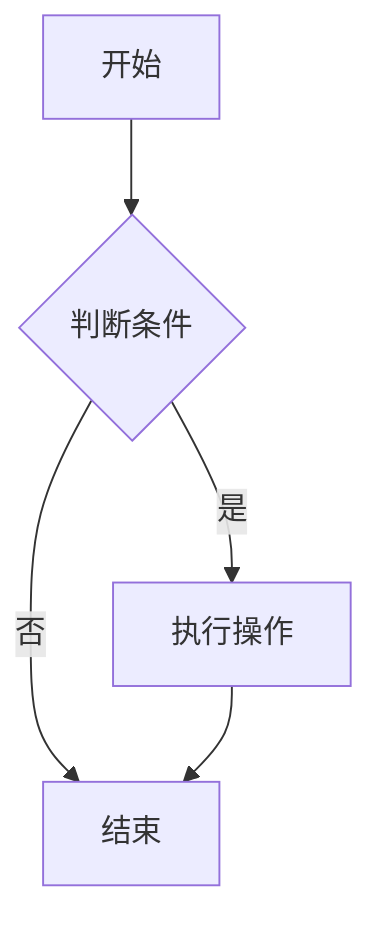
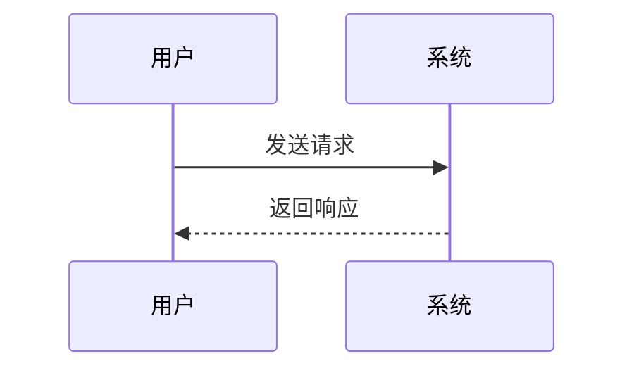
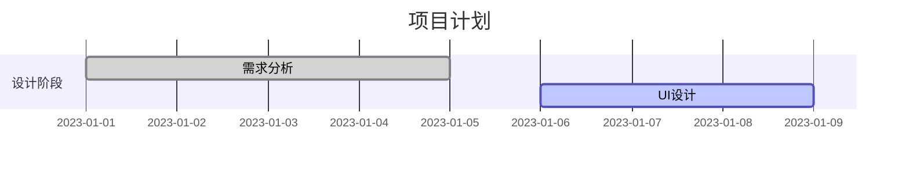
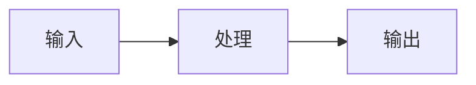

# Markdown 扩展

本主题在 VitePress 原有 Markdown 功能基础上，扩展了以下功能：

- `<LiveEditor></LiveEditor>` : 实时渲染组件 Demo
- `<Mermaid></Mermaid>` : 图表渲染支持
- 支持 Task List 语法
- 支持自定义容器扩展

## Demo 渲染

在 markdown 文件中，使用 **vue** 语法([为什么用 vue 语法](https://vitepress.dev/guide/using-vue))引入扩展组件`LiveEditor`，并传入`sourceCodePath`(**使用相对路径**)属性，即可渲染出演示代码。

```md
<!-- 引入演示源码使用相对路径 -->

<LiveEditor sourceCodePath="../demo/example/index.jsx"></LiveEditor>
```

#### LiveEditor 属性:

| 属性           | 说明                               | 类型    | 默认值 |
| -------------- | ---------------------------------- | ------- | ------ |
| noStyle        | 是否显示边框样式(目前仅有 padding) | boolean | false  |
| hideCode       | 是否显示源码                       | boolean | false  |
| sourceCodePath | 代码路径(相对路径)                 | string  | null   |

<<< ../demo/example/index.jsx

> 渲染如下: :point_down: :point_down: 可以试试编辑，会实时编译渲染
> <LiveEditor sourceCodePath="../demo/example/index.jsx"></LiveEditor>

## Mermaid 图表

支持多种图表类型的渲染：

### 流程图

````md

````

### 序列图

````md

````

### 甘特图

````md

````

### 可交互图表

使用 `mermaid-example` 可以显示代码和图表切换：

````md

````

## 自定义容器

### 警告容器

````md
```warning
这是一个警告信息
```
````

### 提示容器

````md
```note
这是一个提示信息
```
````

## Task List 使用

使用 `- [ ] something` 或 `- [x] something` 创建任务列表：

```md
- [ ] 未完成任务
- [x] 已完成任务
- [ ] 另一个未完成任务
```

> 渲染如下： :point_down: :point_down:
>
> - [ ] 未完成任务
> - [x] 已完成任务
> - [ ] 另一个未完成任务

## 高级用法

### 组件组合使用

可以将多个组件组合使用，创建丰富的文档体验：

```md
# 按钮组件

## 基础用法

<LiveEditor sourceCodePath="../demo/example/button-basic.jsx"></LiveEditor>

## 不同状态

<LiveEditor sourceCodePath="../demo/example/button-states.jsx"></LiveEditor>
```

### 代码块增强

支持正则表达式语法高亮：

````md
```regexp
/^[a-zA-Z0-9._%+-]+@[a-zA-Z0-9.-]+\.[a-zA-Z]{2,}$/
```
````

### Jison 语法支持

````md
```jison
%lex
%%
[0-9]+    return 'NUMBER'
"+"       return 'PLUS'
%%
```
````
